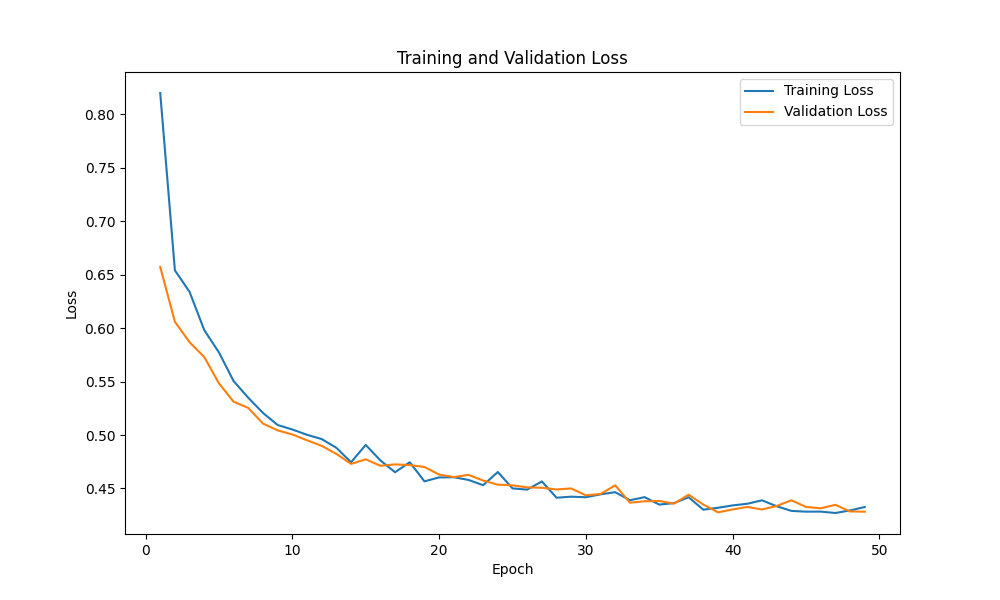
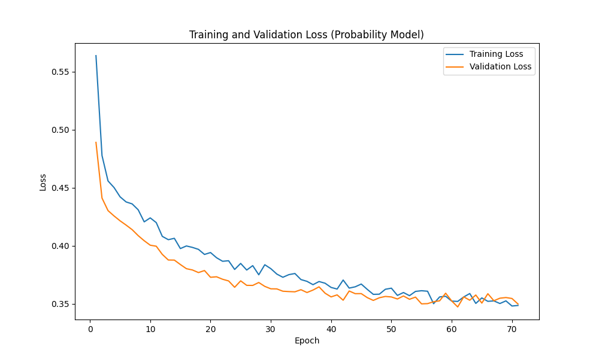
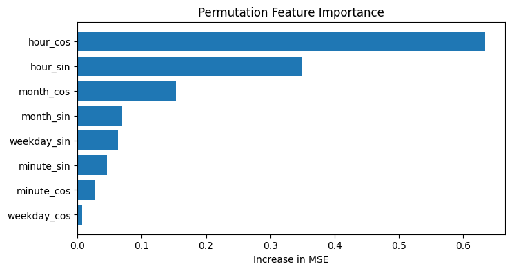
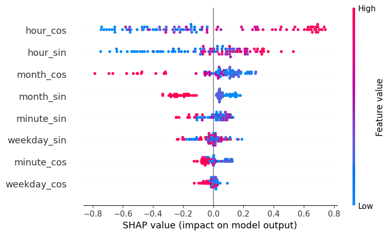

**Voltage Predictor**

- **Project**: Voltage time-series prediction and anomaly risk estimation
- **Location**: `./` (repo root)
- **Primary scripts**: `train_model.py`, `train_model_probability.py`, `predict_api.py`, `explain_model.py`

**Overview**
- **Description**: This repository contains a small PyTorch-based project to predict a scalar "voltage" (or similar time-dependent metric) for given time features (hour, minute, weekday, month) and to estimate risk/anomalies via a probability model. It includes training scripts, an explainability script (SHAP / Integrated Gradients), and a FastAPI-based prediction API.
- **Model files**: stored under `models/` (pretrained weights and normalization stats).

**Requirements**
- **Python packages**: see `requirements.txt`. At minimum the project expects:
  - `torch`, `numpy`, `pandas`, `scikit-learn`, `matplotlib`, `shap`, `captum`, `fastapi`, `uvicorn`
- **OS / Shell**: Tested on Linux (zsh / bash). GPU support available if `torch.cuda.is_available()`.

**Quick Start — Local (virtualenv)**
- **Install:**
```bash
python -m venv .venv
source .venv/bin/activate
pip install -r requirements.txt
```
- **Notes:** Ensure `models/history.csv` exists before training. The training scripts read `./models/history.csv` by default.

**Training**
- **Train regression model (predict value):**
```bash
python train_model.py
```
  - Trains a regression model and saves:
    - `./models/time_value_model.pth` — trained model weights
    - `./models/normalization_stats.npz` — saved mean/std for denormalization
    - `./models/training_loss.png` — training/validation loss plot

- **Train anomaly/probability model (classify low/high anomalies):**
```bash
python train_model_probability.py
```
  - Saves:
    - `./models/probability_model.pth` — probability model weights
    - `./models/probability_stats.npz` — low/high threshold values
    - `./models/training_loss_probability.png` — training/val loss plot

**Explainability**
- **Run explanations (permutation importance, IG, SHAP):**
```bash
python explain_model.py
```
  - Outputs under `./models/`:
    - `permutation_importance.png`
    - `integrated_gradients.csv` (if Captum available)
    - `shap_summary.png` and dependence plots (if SHAP available)

**Prediction API (FastAPI)**
- **Run locally using uvicorn:**
```bash
uvicorn predict_api:app --host 0.0.0.0 --port 8000
```
- **Endpoints:**
  - `GET /predict` — Parameters: `hour` (0-23), `minute` (0-59), `weekday` (0=Mon..6=Sun), `month`(1..12). Returns JSON with `current`, `past_min`, `future_min` predictions and `risk` (0..100).
    - Example:
```bash
curl "http://localhost:8000/predict?hour=12&minute=0&weekday=2&month=6"
```
  - `GET /predictall` — returns CSV text with predictions for all `weekday, hour, minute` combinations (very large output). Use cautiously.

**Model Inputs & Normalization**
- **Input features (8):**
  - `hour_sin`, `hour_cos`, `minute_sin`, `minute_cos`, `weekday_sin`, `weekday_cos`, `month_sin`, `month_cos`
- **Normalization**: training saves mean/std to `./models/normalization_stats.npz`. Predictions denormalize using these values.

**Docker**
- **Build & run training / explain images (project Dockerfile):**
```bash
# build (default Dockerfile runs train_model.py / explain_model.py depending on command)
docker build -t voltage-explain:latest .
# or run training with mounted project directory
docker run --rm -v "$(pwd)":/app -v "$(pwd)/models":/app/models voltage-explain:latest python train_model.py
```
- **Build & run PredictAPI container:**
```bash
docker build -f Dockerfile.predictapi -t voltage_predictor_api:latest .
# Run (mount models so the container can access model files)
docker run --rm -p 8000:8000 -v "$(pwd)/models":/app/models voltage_predictor_api:latest
```
- **docker-compose**: The repository includes `docker-compose.yml` with services for `voltage-explain`, `voltage-model`, `voltage-model-probability` and `predictapi`. You can start profiles individually. Example:
```bash
# run the API service (requires docker-compose v2+ profile support)
docker compose --profile api up -d
```

**Models directory (what to expect)**
- **Pretrained / generated files (under `models/`):**
  - `time_value_model.pth` — regression model weights
  - `probability_model.pth` — anomaly probability model
  - `normalization_stats.npz` — mean/std used for denormalization
  - `probability_stats.npz` — stored low/high threshold values for anomaly labels
  - `history.csv` — source data used for training (required to train)
  - `training_loss.png`, `training_loss_probability.png`, `integrated_gradients.csv`, `permutation_importance.png`, etc.

**Development / Notes**
- **Device**: scripts auto-detect CUDA if available via `torch.cuda.is_available()` and use `DEVICE` accordingly.
- **Data expectations**: `models/history.csv` must contain at least two columns: `state` (numeric or numeric string) and `last_changed` (ISO timestamps). The training script filters unavailable or missing states, takes the minimum value per time window, and encodes cyclical time features.
- **Extending features / lags**: The code contains a `LAGS` variable support — adjust in training/predict scripts to include historical lag features. If you modify feature layout, keep model definitions consistent across training, predict and explain scripts.

**Troubleshooting**
- **Model not loaded in API:** Ensure `./models/time_value_model.pth` and `./models/normalization_stats.npz` exist and are readable by the process.
- **Missing packages:** Install `requirements.txt`. SHAP and Captum are optional (explainability). If SHAP/Caputm not installed, `explain_model.py` will skip relevant blocks.
- **Permission errors in Docker:** When mounting volumes, ensure file permissions allow the container user to read/write `./models`.

**Training Results**
- **Artifacts**: See the `models/` folder for generated plots and artifacts. The most relevant plots are embedded below for quick review.

Regression model training loss:



Probability model training loss:



Permutation feature importance (increase in MSE when a feature is shuffled):



SHAP summary (global feature impact):



- **Quick interpretation:**
  - **Loss curves**: The regression and probability `training_loss` plots show convergence behaviour. A steady drop in training loss with a similarly decreasing validation loss indicates good fit; a widening gap suggests overfitting.
  - **Permutation importance**: The permutation chart highlights which encoded time features increase MSE most when shuffled — useful to confirm which cyclic features carry predictive signal.

**Explainability Insights (SHAP & Integrated Gradients)**
- **Available files:**
  - `models/shap_summary.png` — SHAP summary plot (global feature importance / impact)
  - `models/permutation_importance.png` — permutation importance bar chart
  - `models/integrated_gradients.csv` — numeric mean absolute Integrated Gradients per feature

- **Integrated Gradients (numeric)**: the project stores mean absolute IG attributions in `models/integrated_gradients.csv`. Ranked by importance (mean(|IG|)) the features are:
  1. `hour_cos` — 0.47295
  2. `hour_sin` — 0.25666
  3. `month_cos` — 0.20562
  4. `month_sin` — 0.08371
  5. `minute_sin` — 0.06707
  6. `weekday_sin` — 0.06391
  7. `minute_cos` — 0.05766
  8. `weekday_cos` — 0.03312

- **What this suggests:**
  - **Hourly signal dominates:** `hour_cos` and `hour_sin` together carry the largest attribution, indicating the model strongly relies on the hour-of-day cyclical pattern to predict the value.
  - **Monthly seasonality matters:** `month_cos` / `month_sin` appear next in importance, implying a seasonal monthly effect in the data.
  - **Minute & weekday are weaker:** minute and weekday encodings contribute less but are still non-zero, suggesting fine-grained and weekly patterns are present but weaker than hourly/monthly cycles.

- **SHAP / permutation cross-check:**
  - SHAP (`models/shap_summary.png`) and permutation importance (`models/permutation_importance.png`) provide complementary views: SHAP shows per-sample impact and direction, while permutation importance measures effect on global MSE. Use them together to validate feature importance and check for inconsistencies.

**How to reproduce these plots**
- **Training curves:** Re-run the training scripts — the code saves `training_loss.png` and `training_loss_probability.png` automatically.
- **Integrated Gradients:** `python explain_model.py` computes IG (requires Captum) and writes `models/integrated_gradients.csv`.
- **SHAP:** `python explain_model.py` will also attempt SHAP (if `shap` is installed) and write `models/shap_summary.png` and dependence plots.
